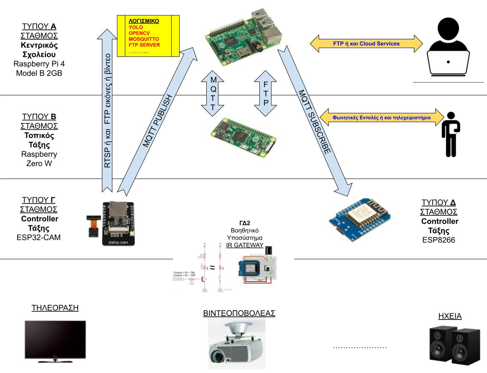
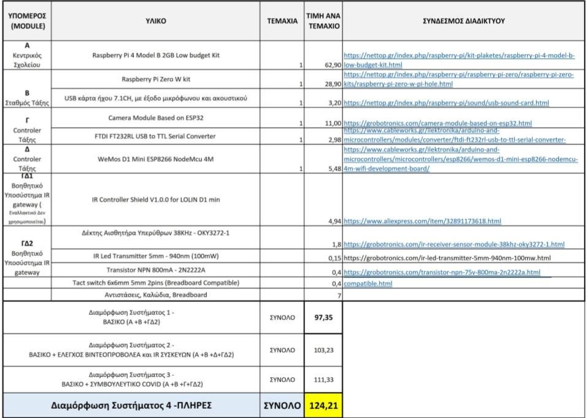

**Ομάδα:** AI-**Ομάδα:** AI-School-Assistant  (Οι μαθητές της **Β πληροφορικής** του Εσπερινού ΕΠΑΛ Αλιάρτου 2020-2021)

**Σχολείο:** Εσπερινό ΕΠΑΛ Αλιάρτου

**Τίτλος έργου:** «Έξυπνος ψηφιακός σχολικός βοηθός με έμφαση στην υποβοήθηση αντιμετώπισης της πανδημίας του COVID-19»

---

># ΥΛΟΠΟΙΗΣΗ ΤΟΥ ΕΡΓΟΥ AI-School-Assistant_

---

Σειρά βίντεο (playlist) σχετικά με την υλοποίηση του έργου και λεπτομέρειες για εγκατάσταση και χρήση
(Περιγραφή Έργου Σχολικού Βοηθού)

https://www.youtube.com/watch?v=TXi_Rk6sHGg&list=PL3BpHR7KN3z14OLyJUfApZnECfTMZNcs8

Σειρά βίντεο (playlist) σχετικά με την πειραματική διαδικασία σχετικα με τον αλγόριβμο αναγνώρισης ατόμου
(ΕΠΑΛ ΑΛΙΑΡΤΟΥ Πειράματα εφαρμογής αλγορίθμο)

https://www.youtube.com/watch?v=hZ1zi9_eIq8&list=PL3BpHR7KN3z1dGxGGSAkyuGgAHgk08K8T

[Αρχική ιστοσελίδα του έργου στο openedtech.ellak.gr](https://openedtech.ellak.gr/robotics2021/exipnos-psifiakos-scholikos-voithos-me-emfasi-stin-ipovoithisi-antimetopisis-tis-pandimias/)

[1-Εγκατάσταση και Διαμόρφωση του Mosquitto στο Raspberry Pi 4
(Κεντρικός server του «Αυτόματου Σχολικού Βοηθού» του Σχολείου)](https://github.com/epal-aliartou/AI-School-Assistant/blob/main/code/1-Node-Type-A-Rpi4-CONFIG/1-Installing-Mosquitto-to-Raspberry-KENTRIKOS.md)

[2-Εγκατάσταση και Διαμόρφωση του Node-RED στο Raspberry Pi 4
(Κεντρικός server του «Αυτόματου Σχολικού Βοηθού» του Σχολείου)
](https://github.com/epal-aliartou/AI-School-Assistant/blob/main/code/1-Node-Type-A-Rpi4-CONFIG/2-Installing-Running-Node-RED-sto-Raspberry-KENTRIKOS.md)

[3-Εκτέλεση Κώδικα ΑΝΙΧΝΕΥΣΗΣ-ΤΗΡΗΣΗΣ ΚΟΙΝΩΝΙΚΩΝ ΑΠΟΣΤΑΣΕΩΝ 
Στον κεντρικό σταθμό του «Αυτόματου Σχολικού Βοηθού» (Raspberry Pi 4)
(με τροφορότηση από τον τοπικό βοηθητικό σταθμό τύπου Γ ESP32-CAM)](https://github.com/epal-aliartou/AI-School-Assistant/blob/main/code/1-Node-Type-A-Rpi4-CODE/code_social_distance/3-install-execute-Social-Distancing-Detector-KENTRIKOS.md)

* [3-1 Εκτέλεση του  script reqs.sh για εγκατάταση προαπαιτουμένων](https://github.com/epal-aliartou/AI-School-Assistant/blob/main/code/1-Node-Type-A-Rpi4-CODE/code_social_distance/reqs.sh)
* [3-2 Εκτέλεση του προγράμματος ανίχνευσης](https://github.com/epal-aliartou/AI-School-Assistant/blob/main/code/1-Node-Type-A-Rpi4-CODE/code_social_distance/detector.py)

[4-Εκτέλεση Κώδικα σε NODERED - Διαδικασία Εισαγωγής στο Raspberry Pi 4
(Κεντρικός server του «Αυτόματου Σχολικού Βοηθού» του Σχολείου)
](https://github.com/epal-aliartou/AI-School-Assistant/blob/main/code/1-Node-Type-A-Rpi4-CODE/code-NodeRed/4-programs-in-Nodered-AISchoolAssistant.md)
* [4-1 Εκτέλεση συνάρτησης σε javascript για φιλτράρισμα μηνυμάτων](https://github.com/epal-aliartou/AI-School-Assistant/blob/main/code/1-Node-Type-A-Rpi4-CODE/code-NodeRed/onmessage.js)
* [4-2 Εισαγωγή και Εκτέλεση προγράμματων σε NODERED (και Webui  για παραμέτρους)](https://github.com/epal-aliartou/AI-School-Assistant/blob/main/code/1-Node-Type-A-Rpi4-CODE/code-NodeRed/flows.json)

[5-Εγκατάσταση και Διαμόρφωση του λογισμικού στο Raspberry Pi 0
(Τοπικός σταθμός τάξης (Εργ.Πληροφορικής) του «Αυτόματου Σχολικού Βοηθού» του Σχολείου)](https://github.com/epal-aliartou/AI-School-Assistant/blob/main/code/2-Node-Type-B-Rpi0-CONFIG/5-Installing-configuring-slave-Rpi0-pythonMQTT.md)

[6-Εκτέλεση Κώδικα στο Raspberry Pi 0
(Τοπικός σταθμός τάξης (Εργ.Πληροφορικής) του «Αυτόματου Σχολικού Βοηθού» του Σχολείου)](https://github.com/epal-aliartou/AI-School-Assistant/blob/main/code/2-Node-Type-B-Rpi0-CODE/6-Installing-Execute-pythonMQTT-and-GUI-actions.md)

* [6-1 Εκτέλεση του το script reqs.sh για εγκατάταση προαπαιτουμένων](https://github.com/epal-aliartou/AI-School-Assistant/blob/main/code/2-Node-Type-B-Rpi0-CODE/EpalSlaveRpi/controller/requirements.txt)
* [6-2 Εκτέλεση του βασικού προγράμματος MQTT client](https://github.com/epal-aliartou/AI-School-Assistant/blob/main/code/2-Node-Type-B-Rpi0-CODE/EpalSlaveRpi/controller/mqtt_client.py)
* [6-3 Εκτέλεση του βοηθητικών προγραμμάτων client](https://github.com/epal-aliartou/AI-School-Assistant/blob/main/code/2-Node-Type-B-Rpi0-CODE/EpalSlaveRpi/controller/helpers)

[7-Εγκατάσταση και Διαμόρφωση λογισμικού στον Τοπικός Controller Τάξης(Camera Module ESP32-CAM)](https://github.com/epal-aliartou/AI-School-Assistant/blob/main/code/3-Node-Type-C-ESP32-CAM-CONFIG/7-installing-config-on-Node-Type-C-ESP32-CAM.md)

[8-Εκτέλεση Κώδικα στον Τοπικός Controller Τάξης (Camera Module ESP32-CAM)]( https://github.com/epal-aliartou/AI-School-Assistant/blob/main/code/3-Node-Type-C-ESP32-CAM-CODE/8-EXECUTE-on-Node-Type-C-ESP32-CAM.md)

[9-Εγκατάσταση και Διαμόρφωση λογισμικού στον Τοπικός Controller Τάξης (WEMOS D1 MINI ESP8266)](https://github.com/epal-aliartou/AI-School-Assistant/blob/main/code/4-Node-Type-D-WEMOS-D1-MINI-ESP8266-CONFIG/9-installing-config-on-Node-Type-D-WEMOS-D1-MINI-ESP8266.md)

[10-Εκτέλεση Κώδικα στον Τοπικός Controller Τάξης (WEMOS D1 MINI ESP8266)](https://github.com/epal-aliartou/AI-School-Assistant/blob/main/code/4-Node-Type-D-WEMOS-D1-MINI-ESP8266-CODE/10-EXECUTE-on-Node-Type-D-WEMOS-D1-MINI-ESP8266.md)

---

---

Σχέδιο ανοιχτού εκπαιδευτικού πόρου σύμφωνα με το OER

---

---

---

># _ΑΡΧΙΚΗ ΠΡΟΤΑΣΗ ΤΟΥ ΕΡΓΟΥ AI-School-Assistant_

---

Παρακάτω περιγράφεται η πρόταση έργου για την συμμετοχή του Εσπερινού ΕΠΑΛ Αλιάρτου στον «3ο Πανελλήνιο Διαγωνισμό Ανοιχτών Τεχνολογιών στην Εκπαίδευση»

# Εισαγωγή - Περιγραφή

Στην παρούσα πρόταση, η ομάδα μας προτείνει την κατασκευή ενός ψηφιακού σχολικού βοηθού βασισμένο στις καινούργιες τεχνολογίες και ιδιαίτερα στην τεχνητή νοημοσύνη. Πιο συγκεκριμένα, το σύστημά μας προσπαθεί να βοηθήσει τον εκπαιδευτικό στο εκπαιδευτικό του έργου καθώς και τον μαθητή στην παρακολούθηση μαθημάτων και εκπόνηση εργασιών και ασκήσεων. Θα μπορούσαμε να πούμε ότι βασικός του στόχος είναι η απαλοιφή, όσο το δυνατόν περισσότερο της σπατάλης χρόνου σε διαδικαστικά θέματα που προηγούνται της εκπαιδευτικής διαδικασίας.

Η εξοικονόμηση του χρόνου αυτού φυσικά κερδίζετε σε όφελος του πραγματικού εκπαιδευτικού έργου. Ο παραπάνω άξονας όμως είναι κάτι παραπάνω από μία τεχνολογική βοήθεια. Θα μπορούσαμε να πούμε ότι μέσω αυτής της διαδικασίας, σε επίπεδο αλλαγής στάσεων και συμπεριφορών, τόσο μαθητές όσο και οι καθηγητές μπορούν να γίνουν βιωματικά μέτοχοι σε μία διαδικασία εσωτερικής δόμησης και αποτελεσματικότητας της εκπαιδευτικής διαδικασίας. Με άλλα λόγια, όταν συνηθίσεις στην καθημερινότητά σου να ασχολείσαι με τα σημαντικά και την παραγωγή έργου και αποτελέσματος τότε αυτό γίνεται συνήθεια και κτήμα σου. Επίσης βοηθά ταυτόχρονα και στη συνειδητοποίηση της αξίας του χρόνου και της προσπάθειας που δεν πρέπει να «πάει χαμένη».

Πέραν των παραπάνω προβλημάτων, που καλείται το σύστημά μας να λύσει , η οδυνηρή πραγματικότητα της πανδημίας είμαι σαφέστατα το _Μέγα πρόβλημα_ που εδώ και δύο χρόνια όλη η κοινωνία καθώς και η εκπαιδευτική κοινότητα προσπαθεί να αντιμετωπίσει. Σαφώς λοιπόν η σύγκλιση των παραπάνω αξόνων με με την προσπάθεια αντιμετώπισης της πανδημίας είναι κάτι παραπάνω από επιθυμητή. Η διευκόλυνση στην τήρηση των μέτρων για την αντιμετώπιση της πανδημίας στην σχολική καθημερινότητας είναι απαραίτητη.

Για τους παραπάνω λόγους δώσαμε ιδιαίτερη έμφαση στην δημιουργία υποσυστημάτων του βοηθού μας τα οποία προσπαθούν επικουρικά και συμβουλευτικά να μας βοηθήσουν στην προσπάθεια της αποφυγής εξάπλωσης της πανδημίας

# Τι παρόμοιο υπάρχει - Τρέχουσα αντιμετώπιση προβλήματος

Στην προσπάθειά μας να ερευνήσουμε την τρέχουσα κατάσταση και να παρατηρήσουμε τι λύσεις υπάρχουν σε παρόμοια προβλήματα καταλήξαμε στις παρακάτω διαπιστώσεις

## Α. Όσον αφορά την πανδημία

Στην περίπτωση της αντιμετώπισης της πανδημίας , η προσπάθεια στηρίζεται στην υλοποίηση κεντρικών εντολών που λαμβάνονται ύστερα από στατιστικές παρατηρήσεις

- Επομένως, δεν υπάρχει κάτι **τεχνολογικό και αυτοματοποιημένο** που να βοηθάει στην πρόληψη
- Επίσης δεν υπάρχει **διαδικασία που κυρίως συμβουλεύει και λιγότερο επιβάλλει** στους ανθρώπους που καλούνται να υλοποιήσουν τα μέτρα.
- Ειδικά σε εκπαιδευτικό περιβάλλον είναι σε όλους μας γνωστό, πόσο δύσκολο είναι να πείσεις εφήβους ή ακόμα περισσότερο να εγγυηθείς την εφαρμογή μέτρων «όταν ο εκπαιδευτικός _ **είναι παρών αλλά και όταν είναι απών** _».

## Β. Όσον αφορά την χρησιμοποίηση της τεχνολογίας

Στον τομέα της χρησιμοποίησης της εκπαιδευτικής τεχνολογίας και υποβοήθησης με εκπαιδευτικό οπτικοακουστικό περιεχόμενο έχουμε να παρατηρήσουμε τα παρακάτω σχετικά με την ελληνική σχολική πραγματικότητα:

- Αρκετά σχολεία που δεν έχουν κατάλληλες υποδομές οι έχουν πεπαλαιωμένες ή ανεπαρκείς
- Αρκετά σχολεία που έχουν αρκετές έως και πολλές ψηφιακές διευκολύνσεις για τον εκπαιδευτικό έργο όμως αυτά δεν χρησιμοποιούνται λόγω:

    - της μη εξοικείωσης
    - του περιορισμένου χρόνου της διδακτικής ώρας
    - έλλειψη τεχνικών γνώσεων
    - έλλειψη τεχνικής υποστήριξης

# Αναγκαιότητα του έργου-Στόχοι

Σύμφωνα με την ανάλυση των δεδομένων που παρουσιάστηκαν στην προηγούμενη παράγραφο, προέκυψε η ιδέα και η πρόταση για το παρόν σύστημα.

Πιο συγκεκριμένα το σύστημα που προτείνουμε έχει τα παρακάτω χαρακτηριστικά τα οποία προσπαθούν να λύσουν τα προβλήματα που προέκυψαν κατά την έρευνά μας. Τα προτεινόμενα και επιθυμητά χαρακτηριστικά είναι τα εξής:

- ο εκπαιδευτικός ασχολείται μόνο με την παραγωγή και εκπαιδευτικού υλικού και σχεδιασμού του μαθήματος και το παραγόμενο υλικό αποθηκεύεται, μεταφέρεται, ταξινομείται και ενεργοποιείται όσο το δυνατόν αυτοματοποιημένα
- Δεν απαιτείται η γνώση των τεχνολογικών υποδομών του σχολείου
- ελαχιστοποιείται η ανάγκη για τεχνική υποστήριξη
- ελαχιστοποιείται ο χρόνος αλληλεπίδρασης με τα μηχανήματα

# Δομή - Χρήση- Υλοποίηση του συστήματος

Το σύστημα περιλαμβάνει τα ακόλουθα μέρη:

## 1.Σταθμός τύπου Α (Κεντρικός Σταθμός Σχολείου - Raspberry Pi 4)

Είναι ο **κεντρικός server του συστήματος και του Σχολείου** , ο οποίος φιλοξενεί διάφορες υπηρεσίες ( **mqtt server, ftp server** ή και **cloud services** , κ.τ.λ).

Οι εκπαιδευτικοί μέσω κατάλληλων λογαριασμών μπορούν να ανεβάζουν το εκπαιδευτικό περιεχόμενο για τα μαθήματα τους στο σταθμό αυτό. Με παρόμοιο τρόπο και οι μαθητές θα μπορούσαν να ανεβάζουν εργασίες και λύση ασκήσεων.

Ο σταθμός αυτός που είναι ενήμερος για το ωρολόγιο πρόγραμμα του σχολείου , μέσω κατάλληλου software, κάνει διαθέσιμο το υλικό αυτό και το δικαίωμα χρήσης τους στους σταθμούς **τύπου Β (σταθμός τάξης).**

Επίσης, ο σταθμός αυτός ενημερώνεται από τους **σταθμούς τύπου Γ (Τοπικός Controler)** για την τήρηση των αποστάσεων λόγω πανδημίας και διατηρεί τα κατάλληλα στατιστικά

## 2.Σταθμός τύπου Β (Τοπικός Σταθμός Τάξης- Raspberry Zero)

Ο σταθμός αυτός είναι επιφορτισμένος με τον τοπικό έλεγχο και αυτοματοποίηση του εκπαιδευτικού έργου σε επίπεδο Τάξης και ωρολογίου προγράμματος.

Επίσης, ελέγχει τα τοπικά εποπτικά ψηφιακά μέσα (όπως βιντεοπροβολείς, τηλεοράσεις, ηχεία, κ.τ.λ.). Ο έλεγχος αυτός επιτυγχάνεται μέσω **mqtt πρωτόκολλου** ( **subscribe - Publish** στα κατάλληλα **topics** ) με τους σταθμούς τύπου Γ και Δ οι οποίοι αποτελούν τις γέφυρες gateways με το πραγματικό Hardware ή τα αντίστοιχα μηχανήματα.

Ένα ενδεικτικό σενάριο χρήσης είναι το παρακάτω. Στην έναρξη της διδακτικής ώρας ενεργοποιεί τον βιντεοπροβολέα , προβάλλοντας την παρουσίαση του καθηγητή που σύμφωνα με το ωρολόγιο πρόγραμμα έχει μάθημα την ώρα αυτή. Το αντίστοιχο αρχείο παρουσίασης και τις πληροφορίες ωραρίου και προφίλ καθηγητή έχουν όπως είπαμε ανακτηθεί από τον **κεντρικό σταθμό τύπου Α** του σχολείου.

Η ενεργοποίηση και επιβεβαίωση το προφίλ του καθηγητή γίνεται μέσω αναγνώρισης προσώπου και επιβεβαίωσης που παρέχεται από τον **σταθμός τύπου Γ**. Επίσης, ο σταθμός αυτός αναλαμβάνει την αναγνώριση και εκτέλεση των φωνητικών εντολών που μπορούν να τροποποιήσουν την παραπάνω ροή γεγονότων. Τέλος, ο σταθμός αυτός είναι υπεύθυνος για την καθοδήγηση μέσω ηχητικών η οπτικών μηνυμάτων για τη σωστή ή όχι Λειτουργία των διαδικασιών , καθώς επίσης και για την τήρηση των αποστάσεων λόγω Κορονοϊού

## 3.Σταθμός τύπου Γ(Τοπικός Controller Τάξης-Camera Module Based on ESP32)

Ο σταθμός αυτός είναι επιφορτισμένος με τις παρακάτω λειτουργίες

- αναγνώριση προσώπου και ενεργοποίηση του προφίλ το αντίστοιχο καθηγητή
- εάν χρησιμοποιείτε για επόπτευση χώρων τότε μεταφέρει την οπτική πληροφορία προς επεξεργασία εικόνας ( **YOLO**  **-** real-time object detection) στον κεντρικό server του συστήματος όπου υπολογίζεται και καταδεικνύεται αν τηρούνται οι αποστάσεις μεταξύ μαθητών
- μέσω των αχρησιμοποίητων gpio pins μπορεί να ελέγχει τα ψηφιακά μηχανήματα της τάξης
- μέσω της διόδου **IR transmitter** (μέρος του **ΓΔ2 Βοηθητικού Υποσυστήματος** ) και αποκωδικοποίησης του αντίστοιχου πρωτοκόλλου μπορεί να ελέγχει βιντεοπροβολείς και τηλεοράσεις
- επικοινωνεί μέσω του πρωτοκόλλου **mqtt** με τον τοπικό σταθμό τάξης τύπου Β

## 4.Σταθμός τύπου Δ(Τοπικός Controller Τάξης-WeMos D1 Mini ESP8266 NodeMcu 4M)

Ο σταθμός αυτός είναι προαιρετικός. Συνίσταται να χρησιμοποιηθεί αντί του σταθμού Γ , όπου δεν χρειάζεται αναγνώριση εικόνας. Αλλά χρειάζεται να ελεγχθεί μόνο Hardware. Το πλεονέκτημα του είναι ότι έχει περισσότερα gpio pins.Οι λειτουργίες του είναι παρόμοιες με του σταθμού τύπου Γ

## 5.ΓΔ2 Βοηθητικό Υποσύστημα(IR Gateway)

Tο υποσύστημα αυτό αναλαμβάνει την επικοινωνία και τον έλεγχο συσκευών που ελέγχονται μέσω προτοκόλλου υπερύθρων (IR protocol) ή με άλλα λόγια σθσκευών πολυμέσων που έχουν τηλεχειριστήριο.Δεν λειτουρεί αυτόνομα αλλά σε σύνδεση με έναν απο τους σταθμούς **τύπου Γ ή Δ**. Στην ουσία **μεταφράζει** τα μηνύματα **Mqtt** που λαμβάνει ο ελεγχτής σταθμός σε αντίστοιχες εντολές του IR protocol της συσκευής που πρέπει να ελεγχθεί και μετά τις μεταδίδει μέσω της διόδου υπερύθρων **IR  LED transmitter**  

# Κύρια Χαρακτηριστικά

- Ασύγχρονη και σύγχρονη επεξεργασία «σχεδίου μαθήματος» και αυτοματοποιημένη υλοποίηση του στην τάξη, όπου αυτό είναι δυνατό
- Ενεργοποίηση προφίλ καθηγητή μέσο αναγνώρισης προσώπου
- Χρονοπρογραμματισμός μαθημάτων σύμφωνα με το προφίλ του καθηγητή με δυνατότητα καθοδήγησης με φωνητικές εντολές
- Αυτοματοποιημένη διαχείριση υπολογιστή και βιντεοπροβολέα της τάξης
- Δυνατότητα προσθήκης αυτοματοποιημένη διαχείριση λοιπόν συσκευών π.χ. Τηλεοράσεις , ηχείων, κ.τ.λ
- Αυτόματη παρουσίαση οπτικοακουστικού υλικού στην τάξη σύμφωνα με τον χρονοπρογραμματισμό του εκπαιδευτικού και επιπλέον καθοδήγηση με φωνητικές εντολές
- Μείωση κατά το δυνατόν των ανταλλαγών αντικειμένων (usb stick εργασιών, pointers για βιντεοπροβολέα , πληκτρολογίων, τηλεχειριστηρίων κ.τ.λ)
- Υποσύστημα παρακολούθησης κοινωνικών αποστάσεων στο προαύλιο ή και σε άλλους χώρους
- Στατιστική επεξεργασία τήρησης των μέτρων κατά της πανδημίας
- Συμβουλευτική προτροπή τήρηση αποστάσεων (μέσω ηχητικών και οπτικών ενδείξεων)

# Υλικά - λίστα των υλικών

Το σύστημα που προτείνεται είναι αρθρωτό και μπορεί να υλοποιηθεί με τρεις κλιμακούμενες διαμορφώσεις. Το προϋπολογιζόμενο κόστος κυμαίνεται **από 98 έως 125 ευρώ**, με προτεινόμενο το πλήρες σύστημα

Λίστα προτεινόμενου εξοπλισμού \*

1. Raspberry Pi 4 Model B 2GB Low budget Kit
2. Raspberry Pi Zero W kit
3. USB κάρτα ήχου 7.1CH, με έξοδο μικρόφωνου και ακουστικού
4. Camera Module Based on ESP32
5. FTDI FT232RL USB to TTL Serial Converter
6. WeMos D1 Mini ESP8266 NodeMcu 4M
7. Δέκτης Αισθητήρα Υπερύθρων 38KHz - OKY3272-1
8. IR Led Transmitter 5mm - 940nm (100mW)
9. Transistor NPN 800mA - 2N2222A
10. Tact switch 6x6mm 5mm 2pins (Breadboard Compatible)
11. Αντιστάσεις, Καλώδια, Breadboard

Αναλυτικότερα το κοστος και τα υλικά :

# Κατασκευή

# Μελλοντικές επεκτάσεις

# Κοινωνική επίδραση
